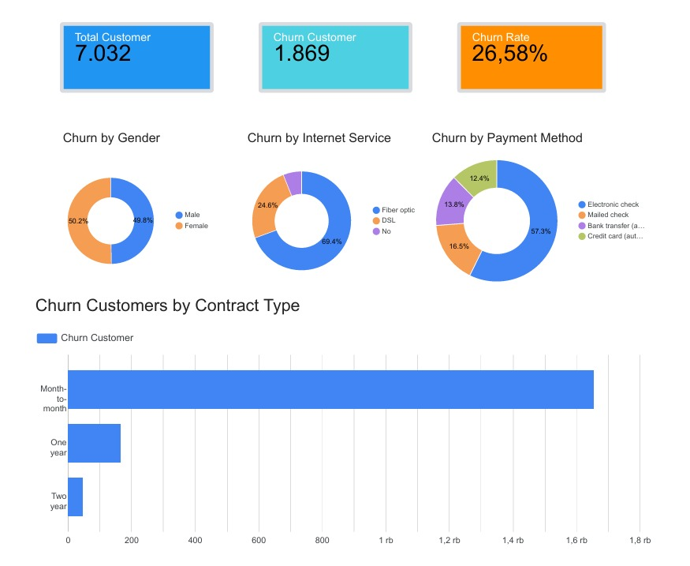

# Customer Churn Analysis

Customer churn analysis project using MySQL and Looker Studio to identify customer churn behavior and business insights.

## Tools Used
- MySQL
- Looker Studio
- SQL Query
- Data Visualization

## Key Insights
- Month-to-month contracts have the highest churn rate
- Fiber optic users dominate churn customers
- Electronic check payment method has the highest churn proportion
- Overall churn rate reached 26.58%

## Dashboard Preview


## Files
- SQL queries for data analysis
- Customer churn dataset
- Dashboard visualization in PDF format
  
## SQL Example
```sql
SELECT Contract,
       COUNT(*) AS total_churn
FROM customer_churn
WHERE Churn = 'Yes'
GROUP BY Contract
ORDER BY total_churn DESC;
```
